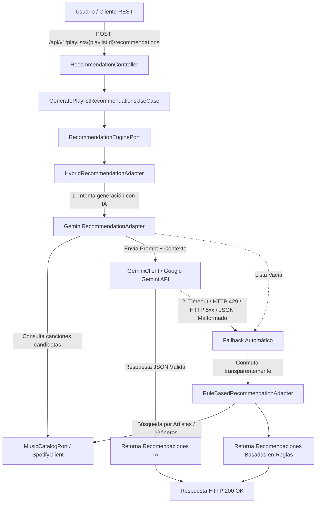

# Playlist API


-brightgreen.svg?style=flat-square)


Microservicio RESTful backend de alto rendimiento desarrollado con **Java 21 LTS** y **Spring Boot 3.2.x**, diseñado para la gestión integral de listas de reproducción musicales, integración en tiempo real con la **Spotify Web API** y generación de sugerencias personalizadas mediante la API de Inteligencia Artificial **Google Gemini**.

- **¿Qué hace?**: Ofrece una API REST stateless segura para crear y gestionar playlists, buscar canciones en Spotify, añadir/remover pistas respetando invariantes del dominio y recibir recomendaciones musicales impulsadas por IA con motor híbrido y fallback resiliente.
- **¿Para quién?**: Desarrolladores, integradores de sistemas de streaming y arquitectos de software que requieren una referencia de producción limpia y desacoplada.
- **¿Por qué existe?**: Demuestra la implementación práctica de **Arquitectura Hexagonal (Ports & Adapters)**, **Clean Architecture**, **Domain-Driven Design (DDD)** y principios **SOLID** sin contaminación de frameworks en el núcleo de negocio.

---

## 📋 Tabla de Contenido

- [1. Últimas Mejoras (Changelog)](#1-últimas-mejoras-changelog)
- [2. Características Principales](#2-características-principales)
- [3. Tecnologías Utilizadas](#3-tecnologías-utilizadas)
- [4. Arquitectura del Sistema](#4-arquitectura-del-sistema)
- [5. Flujo del Motor Híbrido de Recomendaciones](#5-flujo-del-motor-híbrido-de-recomendaciones)
- [6. Estructura del Proyecto](#6-estructura-del-proyecto)
- [7. Casos de Uso e Endpoints REST](#7-casos-de-uso-e-endpoints-rest)
- [8. Requisitos Previos](#8-requisitos-previos)
- [9. Instalación y Guía de Inicio Rápido](#9-instalación-y-guía-de-inicio-rápido)
- [10. Configuración y Variables de Entorno](#10-configuración-y-variables-de-entorno)
- [11. Integración con Google Gemini API](#11-integración-con-google-gemini-api)
- [12. Integración con Spotify Web API](#12-integración-con-spotify-web-api)
- [13. Documentación Interactiva (Swagger / OpenAPI 3)](#13-documentación-interactiva-swagger--openapi-3)
- [14. Ejemplos de Consumo HTTP (cURL)](#14-ejemplos-de-consumo-http-curl)
- [15. Ejecución de Pruebas y Cobertura](#15-ejecución-de-pruebas-y-cobertura)
- [16. Calidad del Proyecto y Patrones de Diseño](#16-calidad-del-proyecto-y-patrones-de-diseño)
- [17. Seguridad & OWASP / 12-Factor App](#17-seguridad--owasp--12-factor-app)
- [18. Estado del Proyecto](#18-estado-del-proyecto)
- [19. Licencia y Autor](#19-licencia-y-autor)

---

## 1. 🚀 Últimas Mejoras (Changelog)

- **Integración con Google Gemini API**: Implementación del adaptador de IA (`GeminiRecommendationAdapter`) desacoplado mediante Arquitectura Hexagonal.
- **Motor Híbrido de Recomendaciones**: Implementación de `HybridRecommendationAdapter` con patrón Decorador / Circuit Breaker.
- **Fallback Automático Resiliente**: Ante timeouts, cuotas excedidas (HTTP 429), errores de red o falla de la IA, el sistema conmuta automáticamente al motor de sugerencias basado en reglas (`RuleBasedRecommendationAdapter`).
- **Robustez en Integración con Spotify**: Sanitización estricta de variables de entorno (`.trim()`), manejo detallado de respuestas `invalid_client` y HTTP 403 Forbidden.
- **Seguridad y Cumplimiento OWASP**: Externalización total de credenciales y secretos (`GEMINI_API_KEY`, `JWT_SECRET`, etc.) alineada con los 12 Factores (Factor III).

---

## 2. ✨ Características Principales

- **Autenticación y Seguridad Stateless**: Emisión y validación de JSON Web Tokens (JWT) firmados con algoritmos HMAC-SHA (HS256) y hashing de contraseñas mediante **BCrypt**.
- **Gestión Integral de Playlists**: Creación, lectura, actualización de nombres, eliminación y listado de listas de reproducción asociadas a usuarios.
- **Integración Real con Spotify Web API**: Búsqueda en tiempo real de canciones por título, artista o álbum mediante OAuth2 Client Credentials Flow.
- **Gestión de Canciones en Playlists**: Adición y eliminación de canciones validando reglas de negocio e invariantes de agregados (prevención de duplicados).
- **Recomendaciones Híbridas con IA y Fallback**: Generación de sugerencias personalizadas combinando la potencia de Google Gemini con resiliencia basada en reglas locales.
- **Arquitectura Hexagonal & DDD**: Aislamiento estricto del dominio de negocio respecto a la infraestructura y frameworks de persistencia/red.
- **Documentación Interactiva OpenAPI 3 / Swagger UI**: Especificación OpenAPI 3 estructurada con interfaz interactiva integrada.
- **Suite Completa de Pruebas**: **189 pruebas automatizadas** (unitarias y de integración) con 100% de tasa de éxito (`BUILD SUCCESS`).

---

## 3. 🛠️ Tecnologías Utilizadas

| Categoría | Tecnología / Librería | Versión | Propósito |
| :--- | :--- | :--- | :--- |
| **Lenguaje** | Java LTS | 21 | Sintaxis moderna (Records, Pattern Matching, Sealed Classes, Virtual Threads) |
| **Framework Base** | Spring Boot | 3.2.5 | Framework principal para microservicios y contenedor IoC |
| **Seguridad** | Spring Security | 6.2 | Autenticación stateless, filtros HTTP y autorización granular |
| **Tokens & Cifrado** | JJWT (io.jsonwebtoken) / BCrypt | 0.12.5 | Generación/validación de tokens JWT y hashing seguro de contraseñas |
| **Inteligencia Artificial** | Google Gemini API (v1beta) | REST API | Análisis de playlists y selección de sugerencias personalizadas |
| **API Externa** | Spotify Web API | v1 | Catálogo musical externo mediante Client Credentials OAuth2 Flow |
| **Cliente HTTP** | Spring RestClient | 6.1.6 | Cliente HTTP síncrono fluido para integraciones con Spotify y Gemini |
| **Persistencia & ORM** | Spring Data JPA / Hibernate | 6.5.2 | Mapeo objeto-relacional y adaptadores de persistencia JPA |
| **Base de Datos** | H2 Database | 2.2.224 | Base de datos relacional en memoria para desarrollo y pruebas |
| **Pruebas Automáticas** | JUnit 5 / Mockito / MockMvc | 5.10 / 5.11 | Suite de pruebas unitarias, de componentes y de integración |
| **Documentación** | Springdoc OpenAPI / Swagger UI | 2.5.0 | Especificación interactiva OpenAPI 3 |
| **Construcción** | Apache Maven | 3.9+ | Gestión de dependencias y ciclo de vida de construcción |

---

## 4. 🏛️ Arquitectura del Sistema

La solución aplica los principios de la **Arquitectura Hexagonal (Puertos y Adaptadores)**, **Clean Architecture** y **Domain-Driven Design (DDD)**. El núcleo del dominio está aislado de Spring Boot, bases de datos o servicios de IA externos.

### Responsabilidades de las Capas

1. **Domain Layer (Núcleo de Dominio)**:
   - Contiene los Agregados (`Playlist`), Entidades (`Song`, `User`), Objetos de Valor (`SongTitle`, `ArtistName`, `AlbumName`, `Duration`, `PlaylistName`, `RecommendationScore`), Excepciones de Dominio y Servicios de Dominio (`PlaylistDomainService`, `RecommendationDomainService`).
   - Define los Puertos de Salida (*Output Ports*): `PlaylistRepository`, `UserRepository`, `MusicCatalogPort`, `RecommendationEnginePort`, `AiRecommendationPort`.
   - **Regla de Oro**: Cero dependencias de frameworks o librerías externas.

2. **Application Layer (Casos de Uso)**:
   - Implementa la lógica de orquestación de casos de uso (UC-001 a UC-010).
   - Utiliza exclusivamente Comandos, Queries y Records Result inmutables (`GenerateRecommendationCommand`, `RecommendationResult`).
   - Se comunica con la infraestructura mediante los puertos de salida.

3. **Presentation Layer (Adaptadores de Entrada - Inbound)**:
   - Controladores REST (`AuthController`, `PlaylistController`, `SongController`, `RecommendationController`).
   - Mappers de presentación que convierten DTOs HTTP a Comandos/Queries y Results a Response DTOs.
   - Manejo global de excepciones mediante `@RestControllerAdvice` (`GlobalExceptionHandler`).

4. **Infrastructure Layer (Adaptadores de Salida - Outbound)**:
   - **Google Gemini**: Cliente HTTP (`GeminiClient`) y adaptador (`GeminiRecommendationAdapter`).
   - **Motor Híbrido & Fallback**: Adaptador decorador `HybridRecommendationAdapter` (marcado como `@Primary`).
   - **Reglas Locales**: `RuleBasedRecommendationAdapter` para sugerencias basadas en catálogo de Spotify.
   - **Spotify API**: Cliente `SpotifyClient` con caché thread-safe de tokens OAuth2 y mapper de catálogo (`SpotifyMusicCatalogAdapter`).
   - **Persistencia & Seguridad**: Adaptador JPA (`JpaPlaylistRepositoryAdapter`), seguridad JWT (`JwtTokenProviderAdapter`) y configuración OpenAPI (`OpenApiConfiguration`).

### Diagrama Arquitectónico ASCII

```text
                               +-------------------------------------------------------+
                               |                  PRESENTATION LAYER                   |
                               | (HTTP REST Controllers, DTOs, Handlers, Mappers)      |
                               +---------------------------+---------------------------+
                                                           |
                                                           v  (Commands / Queries)
                               +-------------------------------------------------------+
                               |                   APPLICATION LAYER                   |
                               | (Use Cases: GeneratePlaylistRecommendationsUseCase)   |
                               +---------------------------+---------------------------+
                                                           |
                                                           v  (Uses Domain Model & Ports)
+--------------------------------------------------------------------------------------------------------------------+
|                                                   DOMAIN LAYER                                                     |
|                                                                                                                    |
|   +---------------------------------------+                   +------------------------------------------------+   |
|   |         Agregados & Entidades         |                   |                Output Ports                    |   |
|   |   (Playlist, Song, User, ValueObjects)|                   | (RecommendationEnginePort, AiRecommendationPort)||
|   +---------------------------------------+                   +-----------------------+------------------------+   |
+---------------------------------------------------------------------------------------|----------------------------+
                                                                                        ^
                                                                                        | (Implements Ports)
                               +--------------------------------------------------------+------------------+
                               |                  INFRASTRUCTURE LAYER                                     |
                               |                                                                           |
                               |                   +-----------------------------------+                   |
                               |                   |    HybridRecommendationAdapter    |                   |
                               |                   |            (@Primary)             |                   |
                               |                   +-------+-------------------+-------+                   |
                               |                           |                   |                           |
                               |             (Try Gemini)  v                   v (Fallback)                |
                               |               +-------------------+   +-------------------+               |
                               |               |GeminiRecommender  |   | RuleBasedAdapter  |               |
                               |               +---------+---------+   +---------+---------+               |
                               |                         |                       |                         |
                               |                         v                       v                         |
                               |                 +---------------+       +---------------+                 |
                               |                 | GeminiClient  |       | SpotifyClient |                 |
                               |                 +---------------+       +---------------+                 |
                               +-------------------------|-----------------------|-------------------------+
                                                         |                       |
                                                         v                       v
                                               [Google Gemini API]     [Spotify Web API]
```

---

## 5. 🔄 Flujo del Motor Híbrido de Recomendaciones



---

## 6. 📂 Estructura del Proyecto

```text
com.esteban.playlistapi
├── PlaylistApiApplication.java
│
├── domain
│   ├── exception            # Excepciones puras del dominio (PlaylistNotFoundException, etc.)
│   ├── model                # Agregados y Entidades (Playlist, Song, User, Recommendation)
│   ├── repository           # Puertos de Salida (PlaylistRepository, RecommendationEnginePort, AiRecommendationPort)
│   ├── service              # Servicios de Dominio (PlaylistDomainService, RecommendationDomainService)
│   └── valueobject          # Objetos de Valor inmutables (SongTitle, PlaylistName, RecommendationScore)
│
├── application
│   ├── auth                 # Caso de Uso UC-001 (AuthenticateUserUseCase, DTOs, Ports)
│   ├── playlist             # Casos de Uso UC-002 a UC-006 (Create, Get, List, Update, Delete)
│   ├── recommendation       # Caso de Uso UC-010 (GeneratePlaylistRecommendationsUseCase, DTOs)
│   └── song                 # Casos de Uso UC-007 a UC-009 (AddSong, RemoveSong, SearchSongs)
│
├── presentation
│   ├── advice               # GlobalExceptionHandler (@RestControllerAdvice)
│   ├── controller           # Controladores REST (AuthController, PlaylistController, RecommendationController)
│   ├── dto                  # DTOs HTTP Request/Response/Error (Validation annotations)
│   └── mapper               # Mappers de presentación manuales
│
├── infrastructure
│   ├── ai                   # Integración con Google Gemini API
│   │   ├── adapter          # GeminiRecommendationAdapter (implementa RecommendationEnginePort)
│   │   ├── client           # GeminiClient (RestClient, sanitización Markdown JSON, manejador HTTP)
│   │   ├── config           # GeminiConfiguration, GeminiProperties
│   │   └── dto              # DTOs REST de Gemini (GeminiRequest, GeminiResponse, GeminiRecommendationItem)
│   │
│   ├── recommendation       # Adaptadores de Recomendación Híbridos
│   │   ├── adapter          # HybridRecommendationAdapter (@Primary), RuleBasedRecommendationAdapter
│   │
│   ├── configuration        # BeanConfiguration, OpenApiConfiguration
│   ├── persistence          # Adaptadores JPA, Entidades JPA, Repositorios Spring Data
│   ├── security             # Filtro JWT, SecurityConfig, Adaptadores Token y PasswordEncoder
│   └── spotify              # Integración real Spotify Web API
│       ├── adapter          # SpotifyMusicCatalogAdapter (implementa MusicCatalogPort)
│       ├── client           # SpotifyClient (RestClient, OAuth2 Token Cache)
│       ├── config           # SpotifyProperties, SpotifyConfiguration
│       ├── dto              # DTOs internos deserializadores JSON de Spotify
│       └── mapper           # SpotifyMapper (SpotifyTrackItem -> Song)
│
└── shared                   # Excepciones compartidas transversales (InvalidCommandException, etc.)
```

---

## 7. 📌 Casos de Uso e Endpoints REST

| Código | Método HTTP | Endpoint | Descripción | Autenticación |
| :--- | :--- | :--- | :--- | :--- |
| **UC-001** | `POST` | `/api/v1/auth/login` | Autentica a un usuario por email/contraseña y genera un Token JWT de acceso. | Pública |
| **UC-002** | `POST` | `/api/v1/playlists` | Crea una nueva lista de reproducción inmutable asociada al usuario autenticado. | JWT Obligatorio |
| **UC-003** | `GET` | `/api/v1/playlists/{playlistId}` | Consulta el detalle completo de una playlist con su lista de canciones. | JWT Obligatorio |
| **UC-004** | `GET` | `/api/v1/playlists` | Lista de forma resumida todas las playlists del usuario autenticado. | JWT Obligatorio |
| **UC-005** | `PUT` | `/api/v1/playlists/{playlistId}` | Actualiza el nombre de una playlist validando invariantes del dominio. | JWT Obligatorio |
| **UC-006** | `DELETE` | `/api/v1/playlists/{playlistId}` | Elimina permanentemente una playlist del usuario. | JWT Obligatorio |
| **UC-007** | `POST` | `/api/v1/playlists/{playlistId}/songs` | Agrega una canción del catálogo de Spotify a la playlist especificada. | JWT Obligatorio |
| **UC-008** | `DELETE` | `/api/v1/playlists/{playlistId}/songs/{songId}` | Remueve una canción de una playlist existente. | JWT Obligatorio |
| **UC-009** | `GET` | `/api/v1/songs/search` | Consulta en tiempo real el catálogo de Spotify por artista, título o álbum. | JWT Obligatorio |
| **UC-010** | `POST` | `/api/v1/playlists/{playlistId}/recommendations` | Genera recomendaciones personalizadas con IA / Motor Híbrido. | JWT Obligatorio |

---

## 8. ⚙️ Requisitos Previos

- **Java Development Kit (JDK)**: Versión 21 LTS o superior configurado en la variable `JAVA_HOME`.
- **Apache Maven**: Versión 3.9.0 o superior.
- **Cuenta de Desarrollador Spotify**: Para obtener `SPOTIFY_CLIENT_ID` y `SPOTIFY_CLIENT_SECRET`.
- **Google AI Studio API Key**: Para obtener `GEMINI_API_KEY` (opcional; si no se configura, opera automáticamente en modo Rule-Based Fallback).

---

## 9. 🚀 Instalación y Guía de Inicio Rápido

Ejecute la siguiente secuencia de comandos en su terminal para clonar, configurar e iniciar el microservicio localmente:

```bash
# 1. Clonar el repositorio
git clone https://github.com/estebanhenao/Playlist_API.git

# 2. Navegar al directorio del proyecto
cd Playlist_API

# 3. Configurar variables de entorno requeridas
export SPOTIFY_CLIENT_ID="tu_spotify_client_id"
export SPOTIFY_CLIENT_SECRET="tu_spotify_client_secret"
export GEMINI_API_KEY="tu_gemini_api_key"

# 4. Limpiar, compilar y verificar la suite completa de pruebas
mvn clean verify

# 5. Iniciar la aplicación Spring Boot
mvn spring-boot:run
```

El servidor iniciará exitosamente en `http://localhost:8080`.

---

## 10. 🔑 Configuración y Variables de Entorno

La aplicación utiliza el patrón Twelve-Factor App (Factor III - Configuración en el Entorno). Toda variable sensible o configurable está externalizada en `application.yml` mediante el esquema `${NOMBRE_VARIABLE:valor_por_defecto}`:

| Variable de Entorno | Descripción | Obligatoria | Valor por Defecto / Ejemplo |
| :--- | :--- | :--- | :--- |
| `SERVER_PORT` | Puerto HTTP en el que se ejecuta el servidor Spring Boot | No | `8080` |
| `JWT_SECRET` | Clave secreta para firma de tokens JWT (HS256, mín. 256 bits / 32 bytes) | **Sí (en prod)** | `PLEASE_OVERRIDE_IN_PRODUCTION_WITH_A_SECRET_KEY_OF_AT_LEAST_256_BITS_OR_32_BYTES` |
| `JWT_EXPIRATION` | Tiempo de expiración de los tokens JWT en milisegundos | No | `86400000` (24 horas) |
| `JWT_ISSUER` | Emisor configurado en el Token JWT | No | `PlaylistAPI` |
| `SPOTIFY_CLIENT_ID` | Client ID obtenido en Spotify Developer Dashboard | Sí (para Spotify real) | `test-client-id` |
| `SPOTIFY_CLIENT_SECRET` | Client Secret obtenido en Spotify Developer Dashboard | Sí (para Spotify real) | `test-client-secret` |
| `SPOTIFY_TOKEN_URL` | URL del endpoint OAuth2 de autenticación de Spotify | No | `https://accounts.spotify.com/api/token` |
| `SPOTIFY_API_URL` | URL base de la Spotify Web API v1 | No | `https://api.spotify.com/v1` |
| `GEMINI_API_KEY` | Clave de API de Google Gemini obtenida en Google AI Studio | Sí (para IA real) | `PLACEHOLDER_CONFIGURE_GEMINI_API_KEY` |
| `GEMINI_MODEL` | Nombre del modelo de Google Gemini a invocar | No | `gemini-2.5-flash` |
| `GEMINI_API_URL` | URL base del endpoint REST de Google Gemini v1beta | No | `https://generativelanguage.googleapis.com/v1beta/models` |
| `GEMINI_TIMEOUT_SECONDS` | Timeout de lectura en segundos para peticiones a Gemini | No | `15` |
| `H2_CONSOLE_ENABLED` | Habilita la consola web de H2 Database (`/h2-console`) | No | `true` |

---

## 11. 🤖 Integración con Google Gemini API

- **Desacoplamiento Total**: La capa de Dominio define `RecommendationEnginePort` y `AiRecommendationPort`. La implementación concreta `GeminiRecommendationAdapter` se ubica exclusivamente en `infrastructure/ai/`.
- **Prompt Engineering Anti-Alucinaciones**: El prompt impone a la IA evaluar el contexto musical de la playlist e interactuar únicamente con la lista de candidatos pre-obtenidos de Spotify, restringiendo alucinaciones de títulos o artistas no existentes.
- **Parsing Defensivo de JSON**: `GeminiClient` remueve marcas de formato markdown (` ```json `) y extrae las fronteras del objeto JSON antes de deserializarlo con Jackson.
- **Sin Secretos en Código**: La clave `GEMINI_API_KEY` es inyectada desde variables de entorno y sanitizada con `.trim()`. Nunca se imprime en logs ni se incluye en respuestas HTTP.

---

## 12. 🎵 Integración con Spotify Web API

- **OAuth2 Client Credentials Flow**: Autenticación automática mediante `POST https://accounts.spotify.com/api/token` enviando credenciales codificadas en Base64.
- **Caché Thread-Safe de Token**: `SpotifyClient` almacena el token en memoria mediante `AtomicReference<CachedToken>` con mecanismo Double-Checked Locking.
- **Sanitización y Diagnóstico**: Sanitización de variables de entorno mediante `.trim()`, registro descriptivo de errores `invalid_client` y manejo específico de respuestas HTTP 403 Forbidden.
- **Nota de Compatibilidad de Cuenta Developer**: Algunas APIs avanzadas o restricciones de cuotas de Spotify Web API dependen de las políticas del Spotify Developer Dashboard y de que la cuenta del propietario posea una suscripción activa (Spotify Premium), lo cual es un requerimiento propio de la plataforma externa de Spotify.

---

## 13. 📚 Documentación Interactiva (Swagger / OpenAPI 3)

Una vez iniciada la aplicación, la documentación OpenAPI 3 estructurada e interactiva estará disponible en:

- **Swagger UI (Interactiva)**: [http://localhost:8080/swagger-ui/index.html](http://localhost:8080/swagger-ui/index.html)
- **Especificación OpenAPI 3 (JSON)**: [http://localhost:8080/v3/api-docs](http://localhost:8080/v3/api-docs)

### Autenticación en Swagger UI
1. Realice una petición `POST /api/v1/auth/login`.
2. Copie el valor del token retornado en `accessToken`.
3. Haga clic en el botón **Authorize** en la esquina superior derecha de Swagger UI.
4. Escriba o pegue el token en el campo de texto y presione **Authorize**.

---

## 14. 🧪 Ejemplos de Consumo HTTP (cURL)

### 1. Autenticación / Login (UC-001)

```bash
curl -X POST "http://localhost:8080/api/v1/auth/login" \
     -H "Content-Type: application/json" \
     -d '{
           "email": "esteban@example.com",
           "password": "Password123!"
         }'
```

---

### 2. Generar Recomendaciones con IA / Híbridas (UC-010)

```bash
curl -X POST "http://localhost:8080/api/v1/playlists/a5d8f2b1-3c4e-4f6a-8b9c-1d2e3f4a5b6c/recommendations" \
     -H "Content-Type: application/json" \
     -H "Authorization: Bearer <TU_ACCESS_TOKEN>" \
     -d '{
           "limit": 5
         }'
```

**Respuesta de Ejemplo (HTTP 200 OK)**:
```json
{
  "playlistId": "a5d8f2b1-3c4e-4f6a-8b9c-1d2e3f4a5b6c",
  "recommendations": [
    {
      "songTitle": "Kashmir",
      "artistName": "Led Zeppelin",
      "reason": "AI-selected based on playlist style and genre compatibility with existing rock tracks.",
      "score": 0.97
    },
    {
      "songTitle": "Comfortably Numb",
      "artistName": "Pink Floyd",
      "reason": "Matches the progressive rock atmosphere of your playlist.",
      "score": 0.94
    }
  ],
  "totalRecommendations": 2
}
```

---

## 15. 🧪 Ejecución de Pruebas y Cobertura

El proyecto cuenta con una suite completa de pruebas unitarias y de integración desarrolladas con **JUnit 5**, **Mockito** y **MockMvc**.

```bash
# Ejecutar todas las pruebas del proyecto
mvn test

# Ejecutar verificación completa de construcción
mvn clean verify
```

### Resultados de la Suite de Pruebas
- **Total de Pruebas Ejecutadas**: **189 / 189 Aprobadas** (0 fallos, 0 errores, 0 omitidas).
- **Estado de Construcción**: `BUILD SUCCESS`.
- **Pruebas de Integración**: `AuthIntegrationTest`, `PlaylistIntegrationTest`, `SongIntegrationTest`, `RecommendationIntegrationTest` probando la pila completa HTTP, Security, JPA y H2.

---

## 16. 💎 Calidad del Proyecto y Patrones de Diseño

- **SOLID Principles**:
  - **SRP**: Clases pequeñas con responsabilidad única (`GeminiClient`, `HybridRecommendationAdapter`, `SpotifyMapper`).
  - **OCP**: Nuevos motores de recomendación pueden añadirse implementando `RecommendationEnginePort` sin modificar casos de uso.
  - **LSP / DIP**: Inversión de dependencias mediante los puertos del dominio.
- **Fail-Fast Design**: Validaciones inmediatas mediante `Objects.requireNonNull()` y `@Validated` en Configuration Properties.
- **Resiliencia Automática**: Conmutación transparente al motor basado en reglas en caso de fallos de la IA externa.

---

## 17. 🛡️ Seguridad & OWASP / 12-Factor App

- **Spring Security 6 Stateless**: Sesiones HTTP deshabilitadas (`SessionCreationPolicy.STATELESS`) y protección CSRF desactivada para la API REST.
- **Protección de Secretos**: `GEMINI_API_KEY` y `JWT_SECRET` externalizados mediante variables de entorno y excluidos del repositorio mediante `.gitignore` y `.env.example`.
- **OWASP Top 10 Compliance**: No se escriben claves de API ni tokens en archivos de registro o respuestas de excepción. Los mensajes de error de clientes HTTP externos se truncan para prevenir fuga de información.

---

## 18. 📊 Estado del Proyecto

- **Estado**: **Proyecto Finalizado - Production Ready**
- **Resultado de Construcción**: `BUILD SUCCESS`
- **Total de Pruebas Automatizadas**: **189 / 189 Exitosas**
- **Compatibilidad**: Java 21 LTS & Spring Boot 3.2.x

---

## 19. 📄 Licencia y Autor

### Licencia

Este proyecto está bajo la Licencia **MIT**. Consulte el archivo `LICENSE` para más información.

```text
MIT License

Copyright (c) 2026 Edwin Esteban Henao
```

### Autor

- **Edwin Esteban Henao**
- **GitHub**: [https://github.com/estebanhenao](https://github.com/estebanhenao)